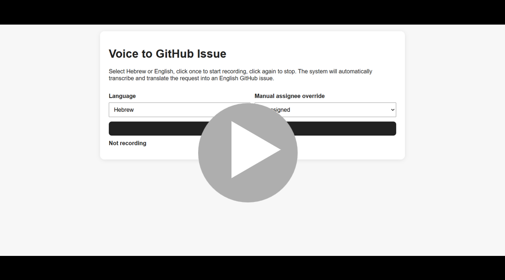

# Voice to GitHub Issue

## Demo Video

This demo shows how the system converts Hebrew or English voice input into a structured English GitHub issue using a single Docker container.

[](https://youtu.be/zaVKvmQmTLo)

A single-container demo tool that turns Hebrew or English voice requests into English GitHub issues.

The system uses one fixed GitHub repository from `.env`. There is no repository selector in the UI.

## What it does

1. User chooses Hebrew or English.
2. User records or uploads audio.
3. Backend transcribes the audio.
4. Backend converts the transcript into an English GitHub issue draft.
5. User reviews and edits the issue.
6. Backend creates the issue in the fixed GitHub repository.

## Architecture

```text
Browser UI
   |
   v
FastAPI single container
   |
   |-- OpenAI audio transcription
   |-- OpenAI issue parsing and English rewriting
   |-- GitHub REST API issue creation
   v
Fixed GitHub repository from .env
```

## Project structure

```text
voice-github-issue-single-docker/
├─ app/
│  ├─ main.py
│  ├─ issue_parser.py
│  ├─ github_client.py
│  ├─ team_config.py
│  └─ static/
│     └─ index.html
├─ requirements.txt
├─ Dockerfile
├─ docker-compose.yml
├─ .env
├─ .env.example
└─ README.md
```

## Configure

Edit `.env`:

```env
OPENAI_API_KEY=your_openai_api_key

GITHUB_TOKEN=your_github_token
GITHUB_OWNER=liatdavid2
GITHUB_REPO=voice-github-issues-demo

OPENAI_TRANSCRIBE_MODEL=whisper-1
OPENAI_TEXT_MODEL=gpt-4o-mini
```

All issues will be created in:

```text
https://github.com/<GITHUB_OWNER>/<GITHUB_REPO>/issues
```

## GitHub token requirements

The token needs access to the target repository and permission to create issues.

If you want labels and assignees to be set correctly, the token should also have permission to write issues in that repository.

## Edit team members

Edit:

```text
app/team_config.py
```

Example:

```python
TEAM_MEMBERS = [
    {"display_name": "Unassigned", "github_login": ""},
    {"display_name": "Liat", "github_login": "liatdavid2"},
    {"display_name": "Danny", "github_login": "danny-github-login"},
]
```

The GitHub login must be a real GitHub username with access to the repository.

## Run

From the project root:

```bash
docker compose up --build
```

Open:

```text
http://localhost:8080
```

## Test the backend

```text
http://localhost:8080/api/health
```

Expected response:

```json
{"status":"ok"}
```

## Demo script

Say in Hebrew:

```text
תפתחי באג על זה שכפתור שמירה לא עובד במסך פרופיל ותשייכי לליאת. זה בעדיפות גבוהה.
```

Expected generated issue:

```text
Title:
Save button does not work on the profile screen

Labels:
bug, high-priority, voice-created

Assignee:
liatdavid2
```

## Notes

- Browser recording works on localhost.
- If recording is not supported in the browser, upload an audio file instead.
- The issue is always generated in English.
- The target GitHub repository is fixed by `.env`.
- The backend always adds the `voice-created` label.
